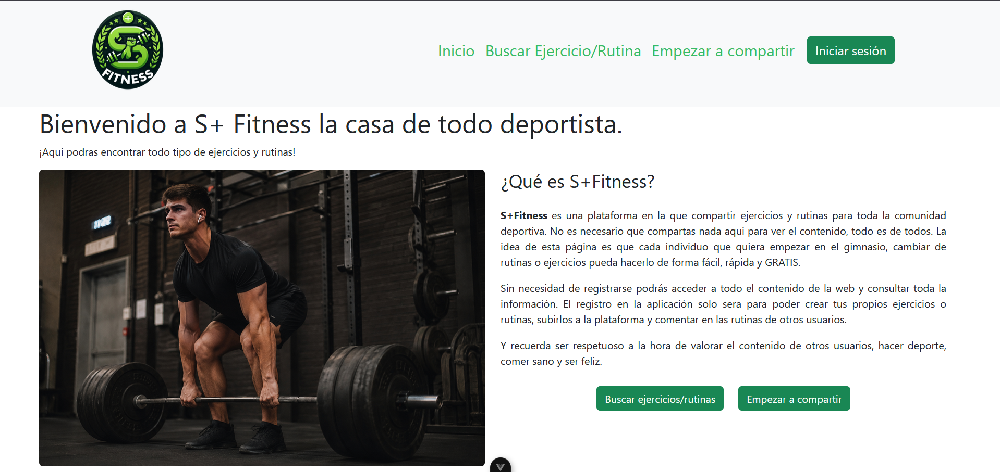
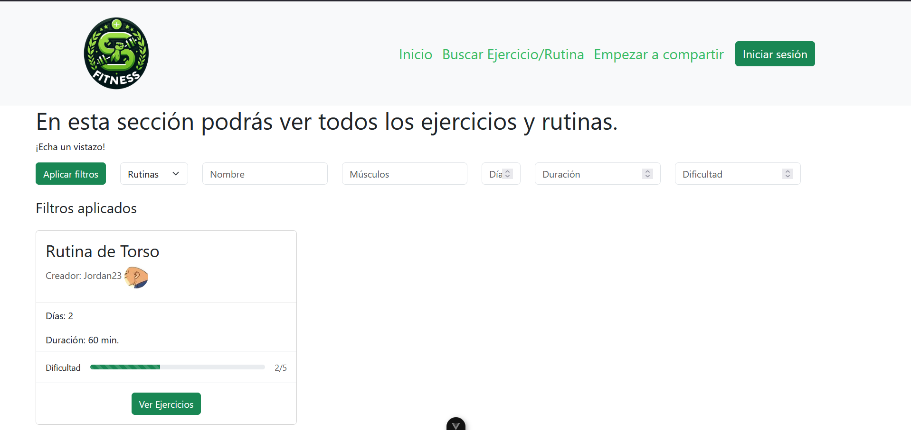
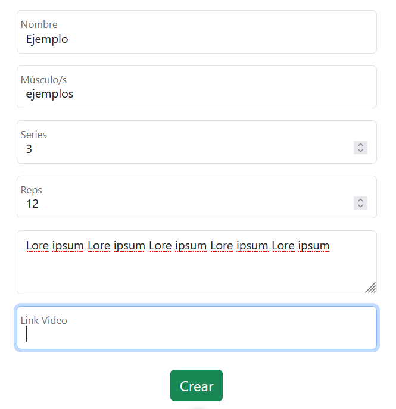
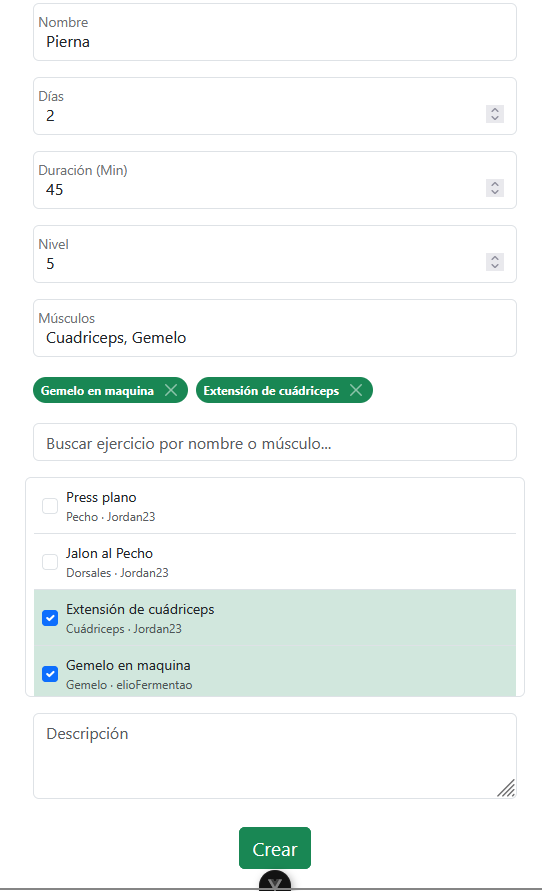
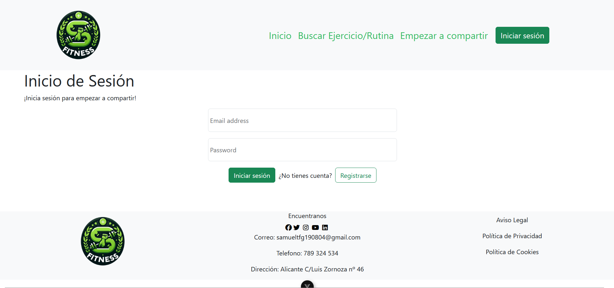

# S+ Fitness

## 1. Introducción al Proyecto
**S+ Fitness 1.0** es una plataforma web integral diseñada para entusiastas y principiantes del mundo del gimnasio. Su objetivo principal es actuar como un repositorio centralizado e interactivo donde la comunidad puede descubrir, organizar y compartir conocimiento relacionado con el entrenamiento físico. 

A menudo, las personas que se inician en el gimnasio se sienten abrumadas por la abismal cantidad de información, mitos y rutinas disponibles en internet, sin saber a ciencia cierta por dónde empezar o en qué fuentes confiar. La motivación detrás de este proyecto nace de la necesidad imperante de ofrecer una herramienta que estructure este conocimiento de manera accesible, fiable y, sobre todo, orientada a la comunidad. 

A través de S+ Fitness, los usuarios no solo pueden encontrar rutinas estructuradas y probadas por otros, sino que también pueden aportar su propia experiencia. El sistema permite personalizar el entrenamiento creando ejercicios propios o diseñando rutinas complejas que quedarán a disposición de toda la comunidad, fomentando un entorno de ayuda mutua.

### 1.1. Contexto y Visión
El proyecto se concibe como una solución práctica a un problema cotidiano en el ámbito del deporte. Al centralizar tanto la teoría (ejercicios, descripción, músculos implicados, técnica mediante vídeos) como la práctica (rutinas de entrenamiento estructuradas por días y niveles), se busca reducir la curva de aprendizaje de los nuevos usuarios y proporcionar una herramienta de seguimiento útil para los más avanzados.

### 1.2. Propuestas de Mejora y Futuro
S+ Fitness 1.0 es la base de un ecosistema que aspira a crecer. En posteriores iteraciones del proyecto, se tiene previsto expandir el alcance de la plataforma de manera horizontal hacia el ámbito de la nutrición:
* **Módulo de Nutrición:** Inclusión de un ecosistema completo para crear, compartir y organizar dietas y recetas saludables.
* **Sinergia:** Este módulo funcionará de manera equivalente e integrada con el sistema actual, permitiendo vincular rutinas específicas con planes nutricionales recomendados por la comunidad.

---

## 2. Tecnologías y Herramientas (Stack Tecnológico)
Para el desarrollo de S+ Fitness se ha optado por un ecosistema moderno y robusto que separa claramente la lógica del cliente (Frontend) y del servidor (Backend), permitiendo una arquitectura escalable y un mantenimiento simplificado.

### 2.1. Entorno Cliente (Frontend)
El cliente ha sido diseñado buscando la máxima fluidez y una experiencia de usuario (UX) ininterrumpida.
* **Vue.js:** La interfaz de usuario está construida utilizando Vue.js. Este framework permite el desarrollo de una *Single Page Application* (SPA), lo que significa que la página no necesita recargarse al navegar, ofreciendo una experiencia rápida y reactiva similar a una aplicación nativa.
* **TypeScript:** La integración de TypeScript sobre JavaScript aporta un tipado estático fundamental. Esto hace que el código sea mucho más predictivo, previniendo errores de ejecución durante el desarrollo y facilitando la mantenibilidad a medida que la plataforma adquiere nuevas funcionalidades.
* **Bootstrap:** Como framework de diseño UI/CSS, se ha elegido Bootstrap por su inmensa popularidad y la estandarización que ofrece. Permite la implementación rápida de un diseño *Mobile-First*, asegurando que la plataforma sea completamente *responsive* (adaptable a móviles, tablets y monitores de escritorio) con una apariencia moderna y limpia.

### 2.2. Entorno Servidor (Backend)
El backend actúa como una API RESTful que provee datos y maneja toda la lógica de negocio y la seguridad de la plataforma.
* **PHP & Laravel:** Toda la arquitectura de servidor está sustentada por PHP utilizando el framework Laravel. Laravel fue seleccionado por su elegancia y las poderosas herramientas que incluye de fábrica. Permite un rápido enrutamiento, validación de datos estricta, y una comunicación ágil con la base de datos gracias a Eloquent (su ORM integrado).
* **Autenticación mediante Tokens:** El sistema implementa seguridad basada en tokens (mediante Laravel Sanctum o herramientas similares integradas en Laravel), lo que permite a la aplicación Vue.js autenticarse de manera segura sin depender de las tradicionales variables de sesión, ideal para arquitecturas SPA y futuras aplicaciones móviles.
* **MariaDB / MySQL:** Sistema de gestión de bases de datos relacional (RDBMS) escogido para garantizar la integridad referencial, la ejecución de relaciones complejas y la persistencia de todos los datos críticos.

### 2.3. Entorno de Desarrollo y Herramientas Adicionales
* **Visual Studio Code:** IDE principal utilizado para la codificación, potenciado mediante extensiones específicas para Vue y Laravel.
* **Docker:** Herramienta clave en la infraestructura. Se utiliza para contenedorizar el entorno de desarrollo local (desplegando los contenedores web y de base de datos), asegurando una consistencia total y evitando el clásico problema de "funciona en mi máquina".
* **Miró:** Plataforma utilizada para la fase de ideación, esquematización de los diagramas de arquitectura de software, casos de uso y modelo de datos.
* **Pixlr:** Editor gráfico para la adaptación y optimización de recursos visuales y esquemas.

---

## 3. Funcionalidades del Sistema y Flujo de Trabajo
El modelo de interacción de la aplicación se vertebra en torno a la participación activa de la comunidad, estableciendo diferentes niveles de acceso según el rol del usuario, asegurando que la plataforma esté moderada y sea útil.

### 3.1. Roles y Nivel de Acceso
1. **Usuarios Invitados (Visitantes):** 
   Tienen acceso de lectura a todo el contenido público de la plataforma de forma inmediata. Pueden navegar por el catálogo global de ejercicios, visualizar vídeos explicativos y consultar los detalles técnicos de las rutinas creadas por la comunidad. Este rol funciona como un escaparate ideal para quienes solo buscan información puntual sin compromisos.
2. **Usuarios Registrados (Comunidad):** 
   Constituyen el verdadero motor de la aplicación. Al registrarse en la plataforma, los usuarios adquieren privilegios de escritura e interacción:
    * **Creación de Ejercicios:** Pueden incorporar nuevos movimientos al diccionario global. Para ello, deben detallar información exhaustiva: grupo muscular implicado, número recomendado de series, repeticiones óptimas, una descripción textual detallada de la técnica y, opcionalmente, un enlace a un vídeo demostrativo.
    * **Diseño de Rutinas Personalizadas:** Pueden crear planes de entrenamiento integrales (agrupados por nivel, días semanales y duración). La innovación reside en la modularidad: **al construir una rutina, pueden integrar ejercicios que ellos mismos han creado o incorporar ejercicios creados por otros miembros**. El sistema respeta de manera estricta la autoría, mostrando siempre quién fue el creador original del ejercicio empleado.
    * **Gestión de Perfil y Contenido:** Poseen control total sobre sus datos personales y una fotografía de perfil (gestionada de forma segura en el servidor). También pueden editar y eliminar el contenido (ejercicios o rutinas) que hayan aportado previamente.
3. **Administradores:** 
   Usuarios designados con una bandera especial de privilegios. Su función principal es la moderación de la comunidad: supervisar el contenido publicado, evitar el spam y eliminar rutinas o ejercicios que contengan información errónea o inapropiada.

### 3.2. Diagrama de Casos de Uso
El siguiente esquema visualiza de forma gráfica las interacciones y los límites funcionales descritos entre los diferentes tipos de actores (invitado, usuario, administrador) y el núcleo de la aplicación:

---

## 4. Arquitectura y Diseño de la Base de Datos
Para dar soporte técnico, escalable e íntegro a todas estas funcionalidades, se ha diseñado una base de datos relacional altamente normalizada. La estructura subyacente de `splus_db` aprovecha las características avanzadas de relaciones, claves foráneas y encriptación.

### 4.1. Descripción de las Entidades y Lógica Interna
El esquema se sostiene sobre cuatro entidades de negocio principales y una de seguridad:

* **Usuarios (`users`):** Almacena la información de identidad de la comunidad. Las contraseñas no se almacenan en texto plano, sino que se encuentran fuertemente encriptadas (mediante el algoritmo *Bcrypt* de Laravel). Incluye un campo booleano `admin` que determina de forma directa y eficiente si el usuario cuenta con los privilegios de moderación.
* **Seguridad y Sesiones (`personal_access_tokens`):** Esta tabla gestiona la capa de seguridad de la API. Almacena los tokens generados tras un login exitoso, permitiendo que la aplicación Vue se comunique de forma segura con los *endpoints* del backend en cada petición.
* **Ejercicios (`exercises`):** Esta tabla conforma la enciclopedia de la aplicación. Internamente, posee una clave foránea (`CodU`) que establece una relación de pertenencia de **1 a Muchos (1:N)** con la tabla de usuarios: un usuario puede crear infinitos ejercicios, pero un ejercicio específico pertenece exclusivamente al usuario que lo redactó originalmente.
* **Rutinas (`routines`):** Agrupa de manera lógica los planes de entrenamiento. Guarda métricas vitales para los filtros de búsqueda, tales como `Dias` semanales, `Duracion` estimada en minutos, `Nivel` de dificultad y `Musculos`. Al igual que los ejercicios, está vinculada al usuario creador mediante otra relación **1:N**.
* **Composición de Rutinas (`routines_exercises`):** Se trata de una tabla pivote o intermedia absolutamente vital. Esta tabla resuelve la complejidad de la relación de **Muchos a Muchos (N:M)** entre rutinas y ejercicios. Gracias a esta estructura, un único ejercicio (ej: "Sentadillas") puede estar presente de forma simultánea en miles de rutinas distintas; y a su vez, una única rutina puede albergar decenas de ejercicios variados. Todo ello sin duplicar datos en la base principal.

### 4.2. Diagrama Entidad-Relación
El siguiente diagrama detalla el mapa conceptual estructural entre los usuarios y el contenido generado. Ilustra gráficamente cómo las entidades clave se relacionan entre sí garantizando la trazabilidad de la autoría y la consistencia de los entrenamientos modulares:

## Vista previa

La aplicacción incluye múltiples secciones:

* Home
* Sign In y Log in
* Buscador de Ejercicios y Rutinas
* Creador de Ejercicios y Rutinas

Capturas de pantalla de la pagina web

## 5. Capturas de ejemplo

A continuación hay algunas capturas de pantalla tomadas de la aplicación (carpeta `screenshots/`):

- **Home:**

   

- **Listado de rutinas:**

   

- **Página de ejercicio:**

   

- **Crear ejercicio (creador):**

   

- **Crear rutina (creador):**

   

- **Login / Actualizar usuario:**

   

